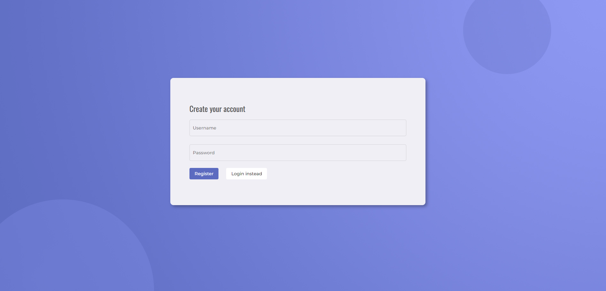

# Agent Chat App
## Web application for instant chat 

Web application provides its' users with functionalities regarding sign in, registration, sending group messages to all active, or specific users, as well as previewing currently active and registered users.

Frontend has been made using **Angular**, and the backend is implemented as a **JavaEE** application.  

All of the server-client communication is made via **WebSockets** and **Agents**, ensuring our enviromend provides its' users with live updates on the system changes.

**Server-server communication** can be made using multiple computers connected on the same network, or a host computer and its virtual machine. Before starting the system, please make sure every non-master node knows it's master IPv4 port, which should be written in the connection preferences. Sample file is provided, but you will have to rename it to `connection.properties` for it to work. `master_node` should remain empty for the main (master) project.

## Software Requirements

 1. Eclipse IDE for Java EE Developers 2018-09 (4.9.0)
 2. Java 8
 3. WildFly 11
 4. JBoss Tools 4.9.0
 5. Node

## Slike ekrana

